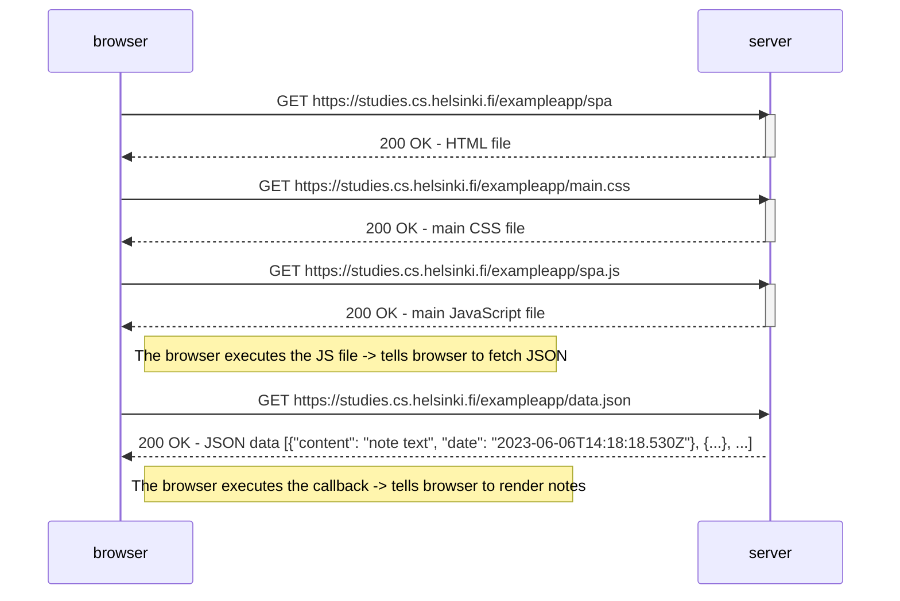
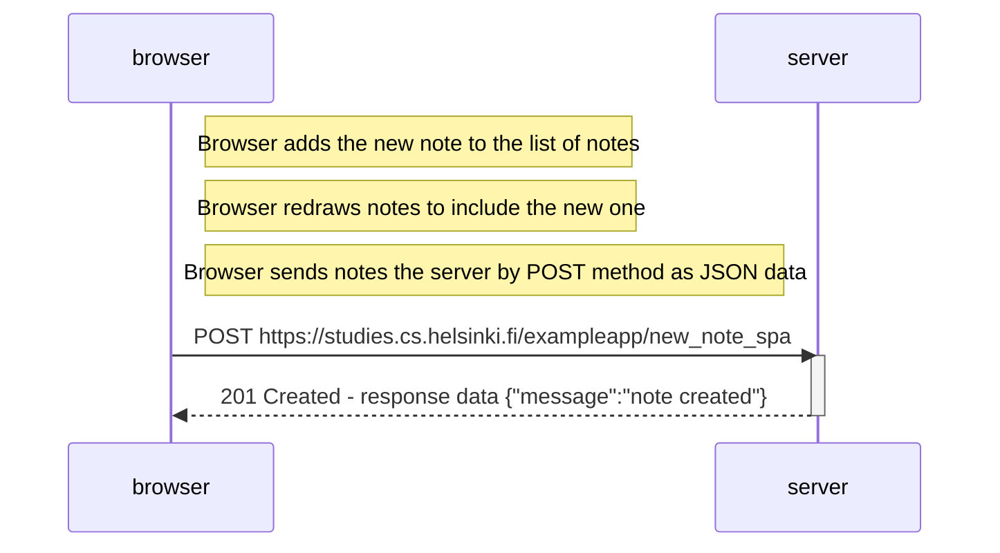

teht 0.4: Uuden muistiinpanon luonti sivulla https://studies.cs.helsinki.fi/exampleapp/notes

    
teht 0.5: Sivun https://studies.cs.helsinki.fi/exampleapp/spa lataaminen

teht 0.6: Uuden muistiinpanon luonti sivulla https://studies.cs.helsinki.fi/exampleapp/spa

